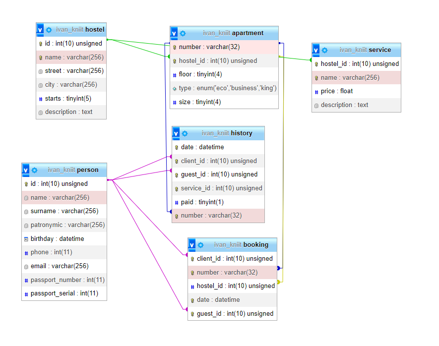

# Базы данных

Отчет по курсу базы данных на КНиИТе

[Схема в SQL](schema.sql)

### Примеры:

* [Пример заполнения базы данных начальными значениями](insert.sql)
* [Простые запросы к базе](select.sql)
* [Создаем минимальные триггеры](trigger.sql)
* [Создание представлений](view.sql)
* [Пример процедур](proc.sql)